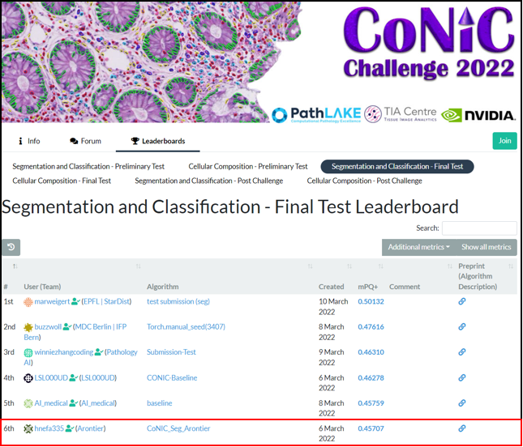
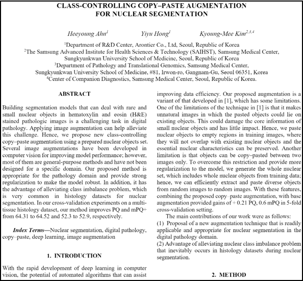

# Project Name : CoNIC (Colon Nuclei Identification and Counting Challenge)

### 0. 개요
(주)아론티어의 정밀진단팀과 삼성서울병원이 미팅 간 Whole-Slide-Image(WSI) 로부터 Cell Segmentation에 대한 알고리즘 개발 필요성 논의 및 이를 위한 Challenge 참가 

 

### 1. 목적
CoNIC Challenge 참가

 
  
### 2. 기간
2021.11.20 ~ 2022.4

 

### 3. 담당 업무
**Challenge Algorithm 개발 및 논문 작성**   

 

### 4. 결과물 
- **대회 전체 26팀 중 6등**
- **학회 논문([pdf](https://github.com/AhnHeeYoung/Competition/blob/master/GrandChallenge-CoNIC/Paper/Paper%20edited.pdf)) 게재**
**(학회명 : International Symposium on Biomedical Imaging (ISBI) 2022 , 1st Author)**

| LeaderBoard | Paper |
|---|---|
|||   
