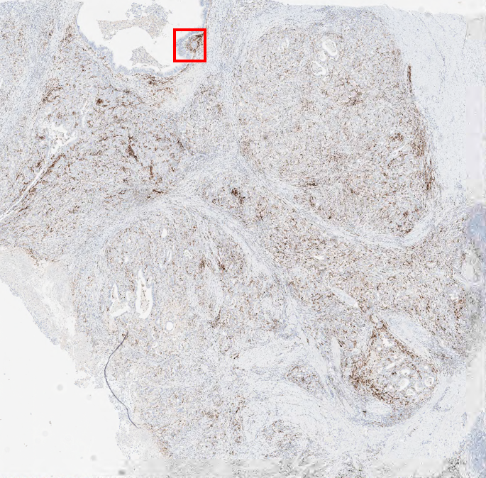
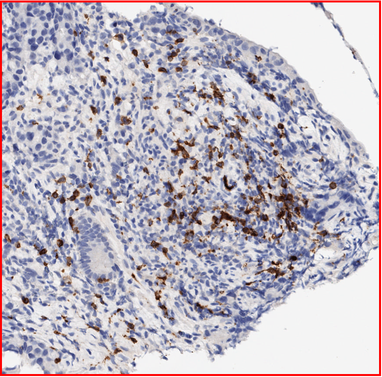
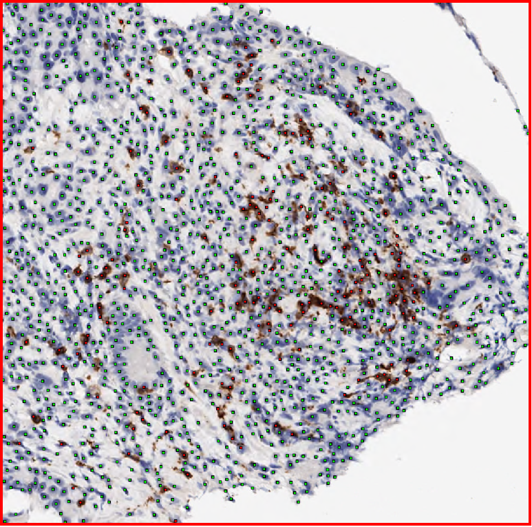
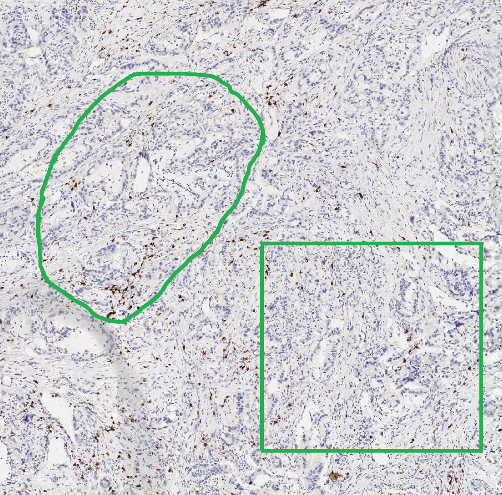
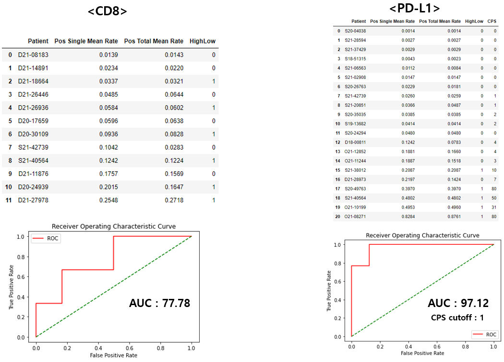

# Project Name : ICIscore (Immune Checkpoint Inhibitor score)

### 0. 개요
(주)아론티어의 정밀진단팀과 삼성서울병원이 전담하는 [PHD Project](https://github.com/AhnHeeYoung/Projects-Arontier/blob/master/ICIscore/doc/PHD.PNG) (Precision Histopathology Diagnosis Project) 중 하나의 sub project   

 

### 1. 목적
삼성서울병원으로부터 받은 CD8, PD-L1 염색된 각각의 Whole-Slide-Image(WSI)로 부터   
**Positive, Negative Cell Detection 알고리즘 개발, 환자에 대한 위험도(High&Low) 분류 성능 계산 및 식약처 인허가**

 
  
### 2. 기간
2021.09 ~ ing

 

### 3. 담당 업무
**데이터 추출, 정제 및 알고리즘 연구 및 개발 전반 업무 담당**   

 

### 4. 결과물 
※논문 작성 예정   

#### 4-1. WSI (PD-L1)

| Input | Output |
|---|---|
|||   

| Input(Enlargement) | Output(Enlargement) |
|---|---|
|||

 
 

#### 4-2. Hotspot (PD-L1)

| Input | Output1 | Output2 |
|---|---|---|
||||

 
 

#### 4-3. High & Low Prediction

| AUC |
|---|
||

 
 
