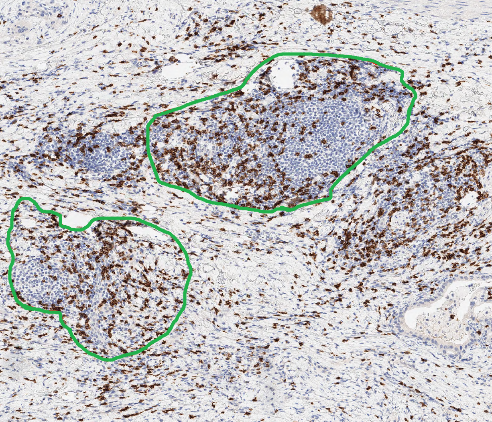

# Project Name : ICIscore (Immune Checkpoint Inhibitor score)

### 0. 개요
- (주)Arontier의 정밀진단팀과 삼성서울병원(병리과 김경미 교수님)이 전담하는   
[PHD Project](https://github.com/AhnHeeYoung/Projects-Arontier/blob/master/ICIscore/doc/PHD.PNG) (Precision Histopathology Diagnosis Project) 중 하나의 sub project   

 

### 1. 목적
- 삼성서울병원으로부터 받은 CD8, PD-L1 염색된 각각의 Whole-Slide-Image(WSI)로 부터 **Positive, Negative Cell Detection 알고리즘 개발**
- 개발된 알고리즘을 이용한 **환자에 대한 위험도(High&Low) 분류 성능 계산**
- 개발된 알고리즘의 **식약처 인허가**

 
  
### 2. 기간
- 2021.01 ~ ing

 

### 3. 담당 업무
- **알고리즘 연구 및 개발 전반 업무 담당**   
- **삼성서울병원과 데이터 Annotation 관련 미팅**
- **식약처 인허가용 소프트웨어 제작을 위한 알고리즘의 Software화 및 Docker Container 제작**    

 

### 4. 결과물 
※논문 작성 예정   

#### 4-1. Cell Detection Algorithm (WSI Prediction)

| Input | Output |
|---|---|
|||   

| Input(Enlargement) | Output(Enlargement) |
|---|---|
|||

 
 

#### 4-2. Cell Detection Algorithm (Hotspot Prediction)

| Input | Output1 | Output2 |
|---|---|---|
||||

 
 

#### 4-3. Evaluation

| Evaluation |
|---|
||

 
 

#### 4-4. High & Low Prediction

| High & Low Prediction |
|---|
||

 
 
