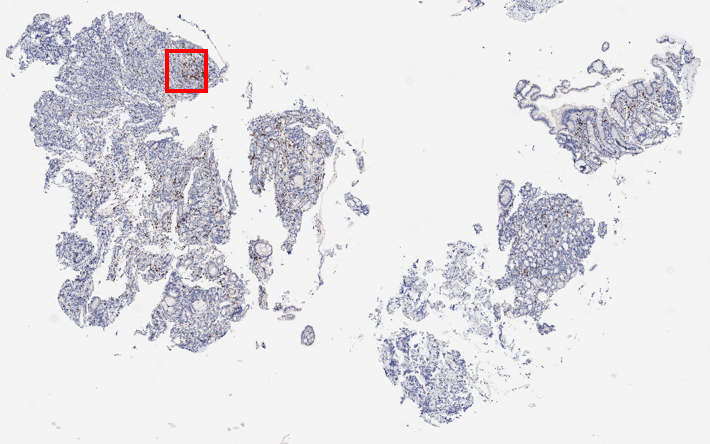
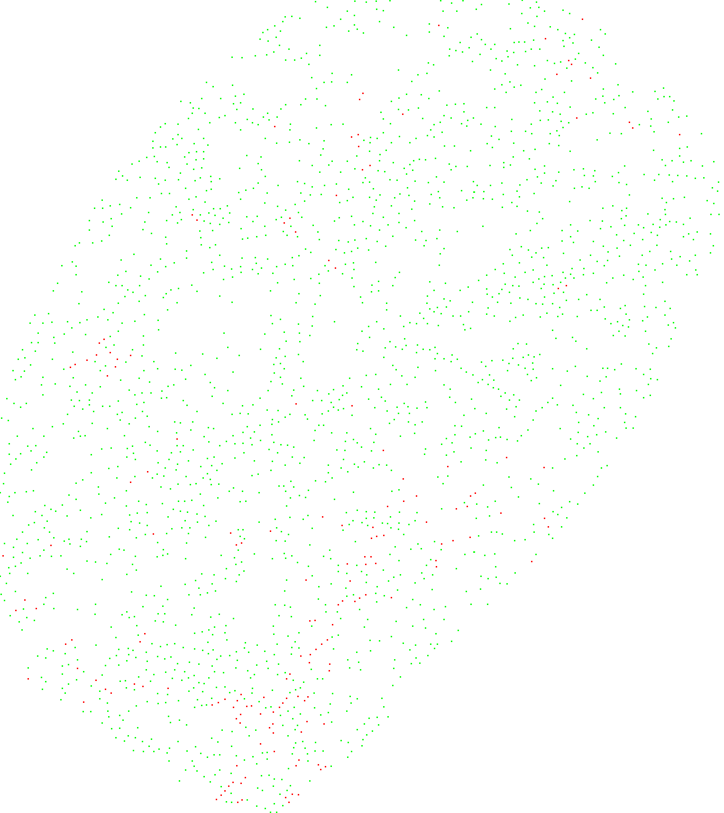

# 


# ICIscore

## Requirements

ICIscore requires `Python 3.8` to run. Also you should have an access to this repository to install `ICIscore` package.

## Installation

ICIscore is protected by Arontier Proprietary License. 
Only authorized users can access `ICIscore` package.
If you are interested, please send an email to `hyahn@arontier.co`.

Assuming you have an access to this repository,
you can install `ICIscore` package by using pip:

```bash
pip install git+ssh://git@github.com/arontier/ICIscore.git   
or   
python setup.py develop
```

If you want to install a specific version:

```bash
pip install git+ssh://git@github.com/arontier/ICIscore.git@version
```

where `version` above is something like `0.0.1`, well a *version*.

All package dependencies will be resolved automatically.
If you stuck with SSH key business, please read [https://help.github.com/en/github/authenticating-to-github/adding-a-new-ssh-key-to-your-github-account](https://help.github.com/en/github/authenticating-to-github/adding-a-new-ssh-key-to-your-github-account) to register your SSH key to GitHub.

## Quickstart

### 1. Data, Model Preparation
To test-drive, you will need an input CD8 or PD-L1 staining WSI(additionally annotated hotspot region)and model files.   
Model files are too big to upload here,   
so you may want to request these files too when you ask for access to this repository.   

Image format supported by `ICIscore` is svs.   
After installing `ICIscore`, make `Input` directories and place your svs image file under `Input` directory.   
Put your 2 model weight files, say `PD-L1.pth`, `CD8.pth` in the `data/checkpoint/` directories.   
Also, you can add hotspot json annotation file made by [QuPath program](https://qupath.github.io/)    
For example, the folder structure should look like this:   

```bash
├── data
│   ├── checkpoint
│   │   ├── PD-L1.pth
│   │   ├── CD8.pth
├── ICIscore
│   ├── Input
│   │   ├── CD8_Sample.svs
│   │   ├── CD8_Sample.geojson
│   │   ├── PDL1_Sample.svs
│   │   ├── PDL1_Sample.geojson
``` 

<br />

### 2. Inference
For inference, we support `2 types of inference : WSI(Whole Slide Image) and Hotspot.`   
For WSI inference, you need to prepare just input svs files.   
For Hotspot inference, you need to prepare input svs files and corresponding json files.   

After finished inferring a input file, you will get `2 output results.`   
(One is visual images for prediction that has multiple magnification (default is set to 1~8x downsample size),   
the other is a json file that includes result information of prediction)

#### 2-1. Using Library

```python
from ICIscore.test import main

main(input_directory = 'Input',
     output_directory = 'Output',
     model_file_path = 'data/checkpoint/CD8(or PD-L1).pth',
     hotspot_prediction = None)
```

※ Here, if `hotspot_prediction` is set to None, WSI prediction will be done.   
If it's set to True, Hotspot prediction will be done.   
In this case, the name of svs, geojson file should be same.   
(ex) sample.svs, sample.geojson )   


#### 2-2. Using Binary
Run the following command to run `ICIscore-test` for test:

```bash
ICIscore-test --input_directory 'Input' --output_directory 'Output' --model_file_path './data/checkpoint/CD8(or PD-L1).pth' --hotspot_prediction None
```

<br />

### 3. Results

#### 3-1. WSI

| Input | Output |
|---|---|
|||   

| Input(Enlargement) | Output(Enlargement) |
|---|---|
|||

<br />
<br />

#### 3-2. Hotspot

| Input | Output1 | Output2 |
|---|---|---|
||||

<br />
<br />

### 4. ETC
#### 4-1. Inference Time, GPU Memory


|  Sample   | Magnification | Width, Height | Batch size | GPU Memory (GB) | Processing Time |
| :-------: | :-----------------: | :-----: | :------: | :------------: | :----: |
|    [S20-49763-3Y(PD-L1)](https://github.com/arontier/ICIscore/tree/master/doc/S20-49763-3Y(PD-L1).PNG) | 20x |   (10024, 10011)    |   8    | 9.33 |  10.52 minutes (7 m for inference, 3.52 m for postprocessing)  |
|    [S21-28594-3T(PD-L1)](https://github.com/arontier/ICIscore/tree/master/doc/S21-28594-3T(PD-L1).PNG) | 20x |   (20005, 20012)    |   8    | 9.33 |  30.4 minutes (21.34 m for inference, 9.06 m for postprocessing)  |
