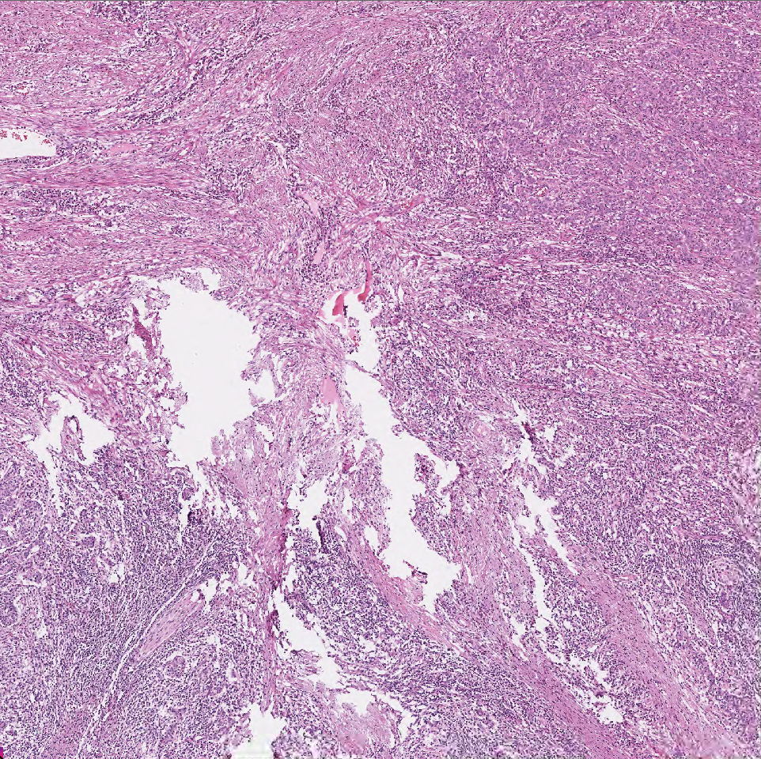
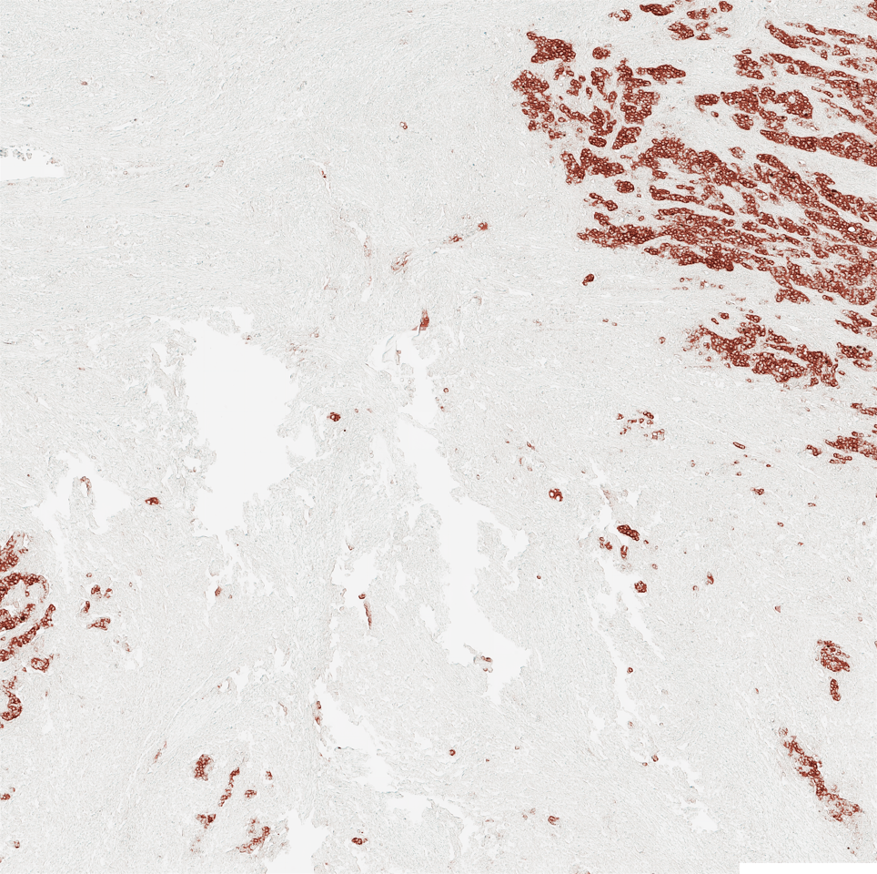
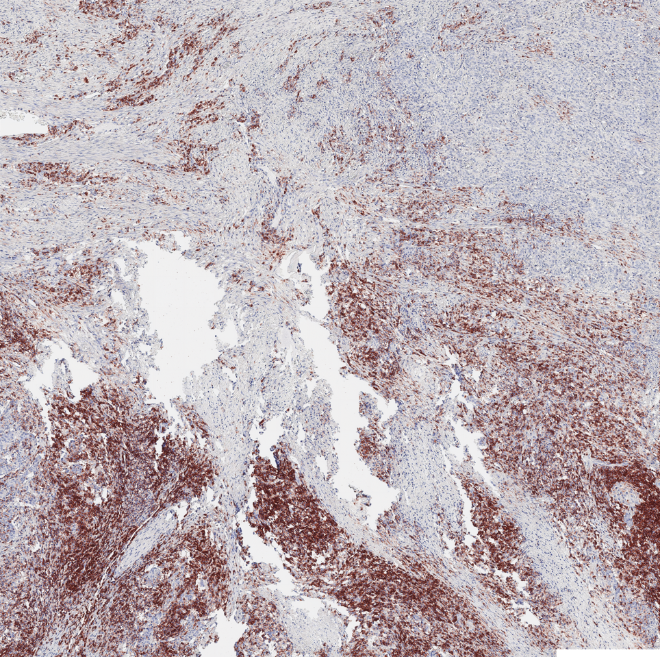
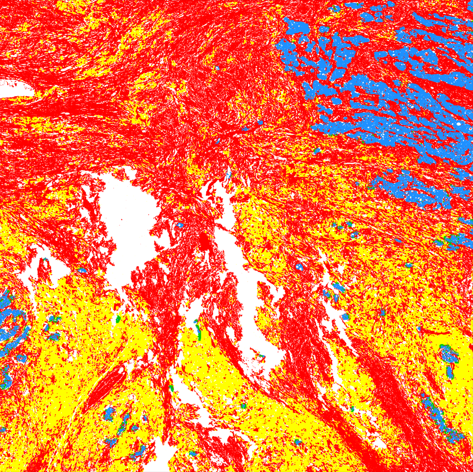
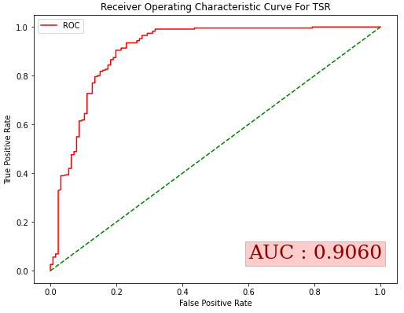
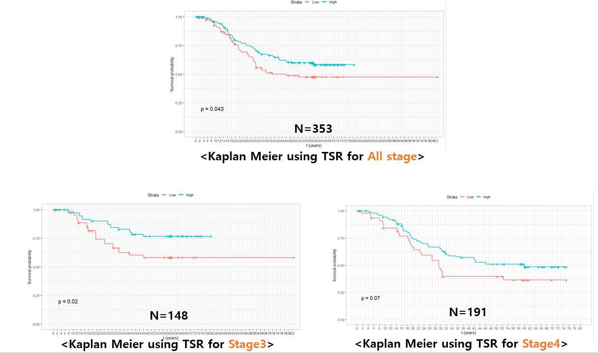

# Project Name : TSR, TIL 예측 알고리즘 개발

### 0. 개요
- (주)Arontier의 정밀진단팀과 삼성서울병원(병리과 김경미 교수님)이 전담하는   
[PHD Project](https://github.com/AhnHeeYoung/Projects-Arontier/blob/master/ICIscore/doc/PHD.PNG) (Precision Histopathology Diagnosis Project) 중 하나의 sub project   

<br />

### 1. 목적
- 삼성서울병원으로부터 받은 H&E (Hematoxylin & Eosin) 염색된 Whole-Slide-Image(WSI)로 부터   
**Image Registration & GAN 을 이용한 CK (Cytokeratin), DESMIN (Muscle), LCA (Lymphocyte) 염색된 WSI 생성 알고리즘 개발**   
- 개발된 알고리즘을 이용한 **TSR (Tumor Stroma Ratio) & TIL (Tumor infiltrating lymphocytes) 계측**
- 계측된 TSR, TIL 값을 이용한 **환자의 위험도(High & Low) 예측 및 통계분석(생존분석)**
- 개발된 알고리즘의 **식약처 인허가**

<br />
  
### 2. 기간
- 2021.01 ~ ing

<br />

### 3. 담당 업무
 ※ 기여도 : 80%
- **알고리즘 연구 및 개발 전반 업무 담당(논문 Research, 데이터 수집, 가공, 모델링, 경량화 등)**   
- **삼성서울병원과 데이터 Annotation 관련 미팅**
- **식약처 인허가용 소프트웨어 제작을 위한 알고리즘의 Software화 및 Docker Container 제작**   

<br />

### 4. 성과 
※논문 작성중   


#### 4-1. Developed Algorithm 
#### 4-1-1. WSI Prediction


| Input(HE) | Output(CK) | Output(LCA) | Output(MIX) |
|---|---|---|---|
|||||
 
:red_square: : Stroma
:blue_square: : Tumor
:yellow_square: : Lympocyte on Stroma
:green_square: : Lympocyte on Tumor

The file name of output is as belows:   
```
Output : 'Stromal_TIL_0.3511_Intratumoral_TIL_0.1373_MIX.png'   
```


<br />
<br />

#### 4-1-2. Hotspot Prediction
| Input(HE) | Output | Output2 |
|---|---|---|
||||


#### The file names of outputs are as belows:   
```
Output : 'TSR_0.8614_Stromal_TIL_0.2976_Intratumoral_TIL_0.0861.png'   
Output2 : 'TSR_0.9332_Stromal_TIL_0.2353_Intratumoral_TIL_0.0570.png'   
```

<br />
<br />

#### 4-2. Patient High & Low Prediction Using TSR
※TIL은 진행중
| High & Low Prediction Using TSR |
|---|
||

<br />
<br />

#### 4-3. Survival Analysis Using TSR
※TIL은 진행중
| Kaplan-Meier Curve Using TSR |
|---|
||

<br />
<br />

#### 4-4. Docker Container For Service
생략
