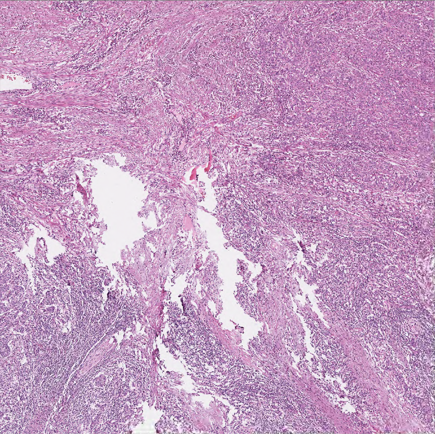

# Project Name : ICIscore (Immune Checkpoint Inhibitor score)

<br />

**0. 개요** : (주)아론티어의 정밀진단팀과 삼성서울병원이 전담하는 [PHD Project](https://github.com/AhnHeeYoung/Projects-Arontier/blob/master/ICIscore/doc/PHD.PNG) (Precision Histopathology Diagnosis Project) 중 하나의 sub project   

<br />

**1. 목적** : 삼성서울병원으로부터 받은 CD8, PD-L1 염색된 각각의 Whole-Slide-Image(WSI)로 부터 **Positive, Negative Cell Detection 알고리즘 개발, 환자에 대한 위험도(High&Low) 분류 성능 계산 및 식약처 인허가**     

<br />
  
**2. 기간** : 2021.09 ~ ing

<br />

**3. 담당 업무** : 데이터 추출, 정제 및 알고리즘 연구 및 개발 전반 업무 담당  

<br />

**4. 결과물** :    
※논문 작성 예정   


4-1. WSI


| Input(HE) | Output |
|---|---|
|||
 
:red_square: : Stroma
:blue_square: : Tumor
:yellow_square: : Lympocyte on Stroma
:green_square: : Lympocyte on Tumor

The file name of output is as belows:   
```
Output : 'Stromal_TIL_0.3511_Intratumoral_TIL_0.1373_MIX.png'   
```

#### 4-2. Hotspot
| Input(HE) | Output | Output2 |
|---|---|---|
||||


#### The file names of outputs are as belows:   
```
Output : 'TSR_0.8614_Stromal_TIL_0.2976_Intratumoral_TIL_0.0861.png'   
Output2 : 'TSR_0.9332_Stromal_TIL_0.2353_Intratumoral_TIL_0.0570.png'   
```
