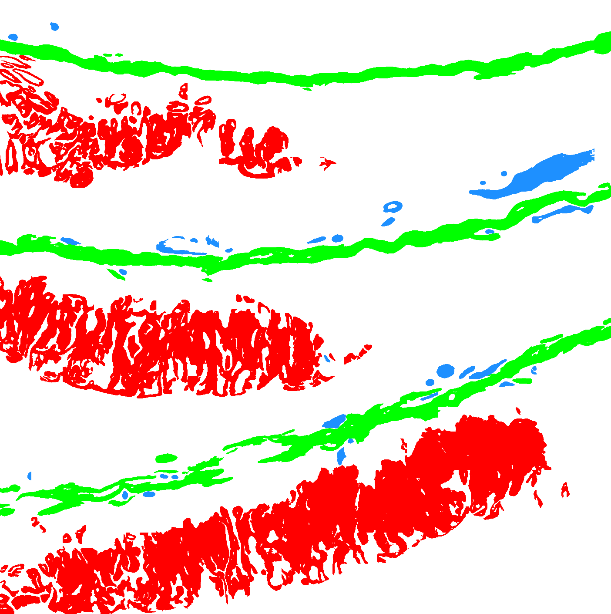

# eLNMscore

## Requirements

eLNMscore requires `Python 3.8` to run. Also you should have an access to this repository to install `eLNMscore` package.

## Installation

eLNMscore is protected by Arontier Proprietary License. 
Only authorized users can access `eLNMscore` package.
If you are interested, please send an email to `hyahn@arontier.co`.

Assuming you have an access to this repository,
you can install `eLNMscore` package by using pip:

```bash
pip install git+ssh://git@github.com/arontier/eLNMscore.git   
or   
python setup.py develop
```

If you want to install a specific version:

```bash
pip install git+ssh://git@github.com/arontier/eLNMscore.git@version
```

where `version` above is something like `0.0.1`, well a *version*.

All package dependencies will be resolved automatically.
If you stuck with SSH key business, please read [https://help.github.com/en/github/authenticating-to-github/adding-a-new-ssh-key-to-your-github-account](https://help.github.com/en/github/authenticating-to-github/adding-a-new-ssh-key-to-your-github-account) to register your SSH key to GitHub.

## Quickstart

### 1. Data, Model Preparation
To test-drive, you will need an input Gastric Cancer WSI and model files.   
Model file is too big to upload here,   
so you may want to request these files too when you ask for access to this repository.   

Image format supported by `eLNMscore` is svs.

After installing `eLNMscore`, make `Input` directories and place your image file under `Input` directory.   
Put your model weight file, say `eLNM.pth` in the `data/checkpoint/` directories.   
The folder structure should look like this:   

```bash
├── data
│   ├── checkpoint
│   │   ├── eLNM.pth
├── eLNMscore
│   ├── Input
│   │   ├── eLNM(Sample).svs
``` 

### 2. Inference
For inference, we support `1 types of inference : WSI(Whole Slide Image).`   
For WSI inference, you need to prepare input svs files.

#### 2-1. Using Library

For example
```python
from eLNMscore.test import main

main(input-directory = 'Input',
     output-directory = 'Output',
     model-file-path = 'data/checkpoint/eLNM.pth')

```


#### 2-2. Using Binary
Run the following command to run `eLNMscore-test` for test:

```bash
eLNMscore-test --input-directory Input --output-directory Output --model-file-path './data/checkpoint/eLNM.pth'
```


```
Argument Options:

  --input-directory      input directory
  --output-directory     output directory
  --output-file-format   output file format
  --stride-rate          overlapping rate in prediction, the bigger, the more accurate but slower
  --downsample-factor    downsampling factor for saving images
  --processing-level     downsampling factor
  --batch-size           batch size for inference
```

### 3. Results

| Input | Output |
|---|---|
|||

### 4. ETC
#### 4-1. Inference Time, GPU Memory


|  Sample   | Magnification | Width, Height | Batch size | GPU Memory (GB) | Processing Time |
| :-------: | :-----------------: | :-----: | :------: | :------------: | :----: |
|    [D21-18814 D](./doc/Input.PNG) | 20x |   (10002, 10004)    |   8    | 9.33 |  4.34 minutes |

