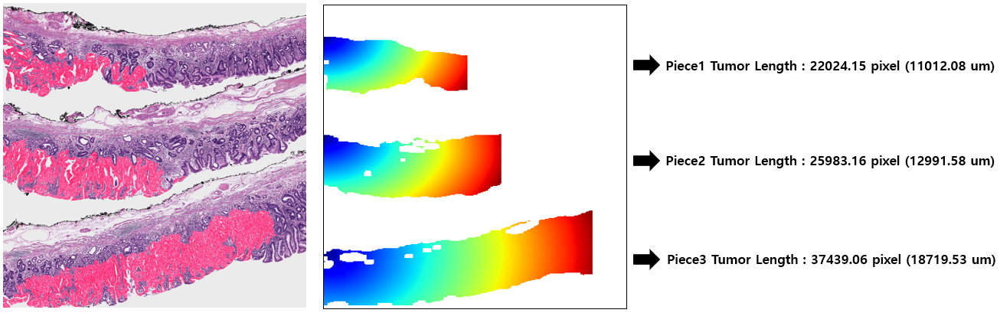
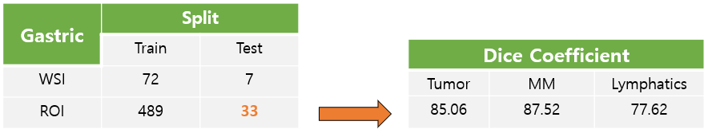

# Project Name : eLNMscore (early gastric cancer Lymph Node Metastasis score)

### 0. 개요
- (주)Arontier의 정밀진단팀과 삼성서울병원(병리과 김경미 교수님)이 전담하는   
[PHD Project](https://github.com/AhnHeeYoung/Projects-Arontier/blob/master/ICIscore/doc/PHD.PNG) (Precision Histopathology Diagnosis Project) 중 하나의 sub project   

 

### 1. 목적
- 위암의 림프노드 전이 여부 예측을 위한 Whole-Slide-Image(WSI)로 부터의   
**3개 Class (Tumor, MM, Lymphatics) Segmentation 알고리즘 개발**   
- 개발된 알고리즘을 이용하여 **림프 노드 전이 예측시 필요한 5가지 Guideline 을 위한 이미지 처리 알고리즘 개발**   
- 개발된 알고리즘의 **식약처 인허가** 

 
  
### 2. 기간
- 2021.01 ~ ing

 

### 3. 담당 업무
- **알고리즘 연구 및 개발 전반 업무 담당**   
- **삼성서울병원과 데이터 Annotation 관련 미팅**   
- **식약처 인허가용 소프트웨어 제작을 위한 알고리즘의 Software화 및 Docker Container 제작**  

 

### 4. 성과 

#### 4-1. Developed Algorithm (WSI Prediction)

| Input | Output |
|---|---|
|||

:red_square: : Tumor
:blue_square: : Lymphatics
:green_square: : MM

 
 

#### 4-2. Image Processing Algorithm for 5 Guildline (5개 중 1개인 Tumor Length 계산)

| Tumor Length Calculation |
|---|
||

 
 

#### 4-3. Algorithm Evaluation

| Evaluation |
|---|
||
